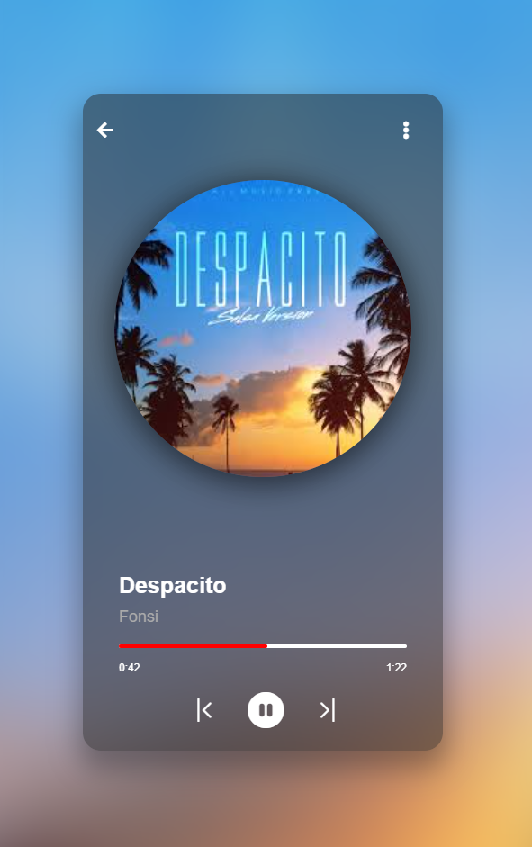

# 🎵 Music Player Web App

A simple and stylish music player built with **HTML, CSS, and JavaScript**, featuring a modern user interface, sound control, and track navigation.



---

## ✨ Features

- Play, pause, previous, and next track controls  
- Display song cover, artist name, and track title  
- Show duration and progress bar  
- Full volume control with slider  
- Dynamic blurred background based on the cover image  

---

## 🚀 Getting Started

### Installation

1. Clone the project or download the files:

```bash
git clone https://github.com/your-username/music-player.git

